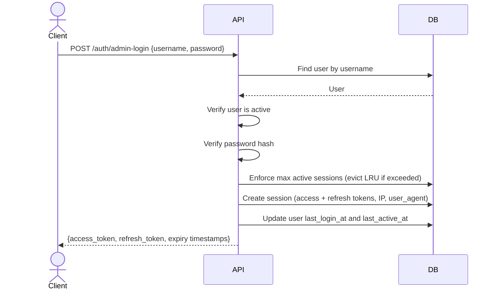
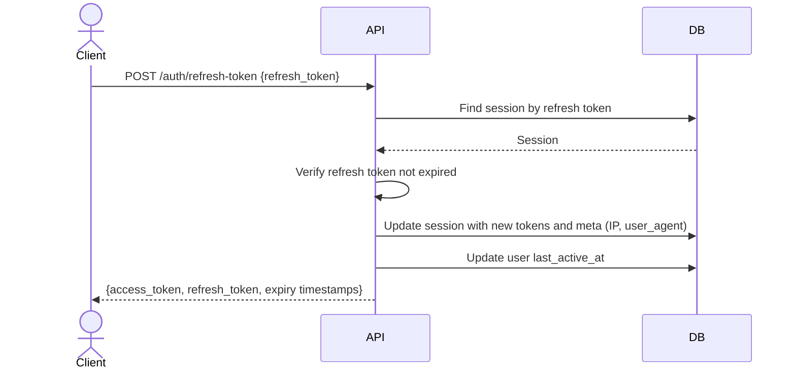
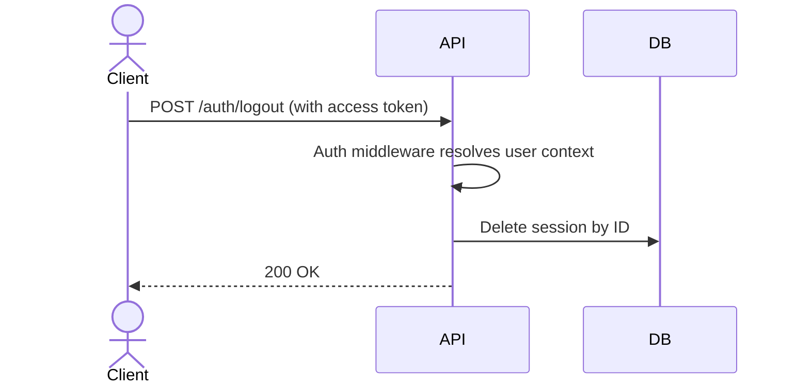
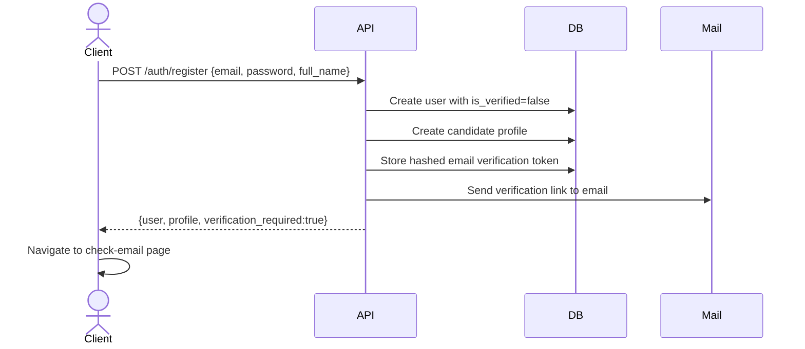
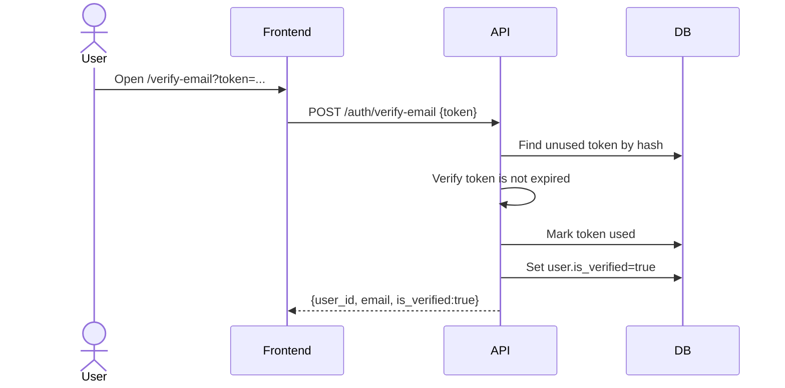

# Authentication & Authorization

## Overview

The system uses token-based authentication with session-backed access and refresh tokens, combined with Role-Based Access Control (RBAC) for authorization. There are no magic bypasses — every user, including the superadmin, is authorized through explicitly assigned permissions.

This derived project supports two credential modes in the same `auth.users` table:

- Admin and operator accounts authenticate with `username + password`
- Public platform users authenticate with `email + password`
- Public platform users may also authenticate with Google OAuth or GitHub OAuth

## Authentication

### Admin Login

- Admin accounts use `username` as the login identifier. `email` and `phone_number` may be null.
- Access token TTL: 15 minutes (default)
- Refresh token TTL: 30 days (default)
- Max active sessions per user: 5 (default) — on login, least recently used sessions are evicted if the limit is exceeded

### Token Refresh

Both tokens are rotated on each refresh — the old tokens become invalid.

### Logout

### Session Cleanup

Expired sessions (where the refresh token has expired) are deleted hourly by the `clean-expired-sessions` async task.

### User-Facing Authentication

### Public User Registration

- Public users register with `email + password + full_name`
- Registration creates a row in `auth.users`
- Registration sets `is_verified = false`
- Registration fails with `EMAIL_ALREADY_EXISTS` when a user already exists with the same email
- If the existing user is an unverified password-registered public user, the client should offer `resend-verification-email` instead of attempting to register again
- Registration also creates a minimal candidate profile
- Registration creates a one-time email verification token and sends a verification email
- `is_verified` tracks whether the public user's primary contact identity has been verified
- Target role, experience level, preferred topics, location, and other profile details are completed later through profile/onboarding APIs
- The `register` use case orchestrates both auth and candidate writes while preserving module boundaries through portals/UOW coordination

### Email Verification

- Password login is blocked until `is_verified = true`
- `resend-verification-email` sends a new verification link for active password users who are not verified yet
- `resend-verification-email` is also the recovery path when a user tries to register again with an email that already belongs to an unverified password-registered account
- Raw verification tokens are sent only to the user's email and are not stored directly
- Development environments should use SMTP capture tooling such as Mailpit so verification emails can be inspected at a local web UI before configuring a real provider

### Public User Login

- Public users authenticate with `email + password`
- Public users must have `is_verified = true` before password login succeeds
- On successful login, the system creates a session and updates both `last_login_at` and `last_active_at`
- Public users may exist without any administrative permissions; authorization remains permission-based where applicable

### Google OAuth Login

- Public users can authenticate with Google OAuth
- Google OAuth requires the provider email to be verified
- The system links the Google identity to an existing user by provider account or matching email, or creates a new public user when needed
- New OAuth-created users receive a minimal candidate profile at first login
- OAuth-created users are marked verified based on Google's verified email signal

### GitHub OAuth Login

- Public users can authenticate with GitHub OAuth
- The system links the GitHub identity to an existing user by provider account or matching email, or creates a new public user when needed
- GitHub OAuth login requires a usable verified email from the provider payload before account creation or linking
- OAuth-created users are marked verified based on GitHub's verified primary email signal

### Get Me

- Authenticated public users can fetch their current account snapshot through `get-me`
- `get-me` returns auth identity data plus linked OAuth providers, candidate profile, preferred topics, progress summary, and avatar metadata when available
- `get-me` is read-only and aggregates data across module boundaries without mutating state

## Authorization

### Request Authorization (Middleware)

Every authenticated request goes through a two-step middleware pipeline:

```mermaid
sequenceDiagram
    actor Client
    participant AuthMiddleware
    participant PermMiddleware as RequirePermission
    participant DB
    participant Handler

    Client->>AuthMiddleware: Request with Bearer token
    AuthMiddleware->>DB: Find session by access token
    DB-->>AuthMiddleware: Session
    AuthMiddleware->>AuthMiddleware: Verify token not expired
    AuthMiddleware->>DB: Find user by session user_id
    DB-->>AuthMiddleware: User
    AuthMiddleware->>AuthMiddleware: Verify user is active
    AuthMiddleware->>DB: Collect all user permissions (role + direct)
    DB-->>AuthMiddleware: Permissions[]
    AuthMiddleware->>AuthMiddleware: Build UserContext {user_id, session_id, permissions}
    AuthMiddleware->>PermMiddleware: Pass request with UserContext

    PermMiddleware->>PermMiddleware: Check user has required permission
    alt Has permission
        PermMiddleware->>Handler: Allow
    else Missing permission
        PermMiddleware-->>Client: 403 FORBIDDEN
    end
```

**Route protection levels:**

| Level            | Middleware                             | Example endpoints                     |
| ---------------- | -------------------------------------- | ------------------------------------- |
| Unauthenticated  | None                                   | `admin-login`, `login`, `register`, `refresh-token` |
| Authenticated    | `AuthMiddleware`                       | `logout`, `get-my-sessions`           |
| Permission-gated | `AuthMiddleware` + `RequirePermission` | `create-user`, `set-role-permissions` |

**RequirePermission behavior:**

- Accepts one or more permissions as arguments — grants access if the user has **at least one** (OR logic)
- For AND logic, chain multiple `RequirePermission` middleware calls on the same route

## RBAC

### Model

Permissions are flat strings following a `module:resource:action` convention (e.g., `auth:user:manage`). There is no hierarchy — `auth:user:manage` does not imply `auth:user:read`.

See [Auth Module ERD](../modules/auth/ERD.md) for entity relationships.

### Permission Sources

A user's effective permissions come from two sources, merged via SQL `UNION`:

1. **Role permissions** — permissions inherited from assigned roles (`user_roles` → `role_permissions`)
2. **Direct permissions** — permissions assigned directly to the user (`user_permissions`)

Duplicates are eliminated by the `UNION`. The merged set is loaded into `UserContext.Permissions` on every authenticated request.

### Superadmin

The superadmin is created via CLI (`./app auth create-superadmin`) during initial system bootstrap. It receives all permissions as **direct user permissions** — there is no special "superadmin" flag or role bypass. The superadmin is authorized through the same permission checks as any other user.

When new permissions are added to the system, they must be added to the `SuperadminPermissions()` list and re-assigned.
