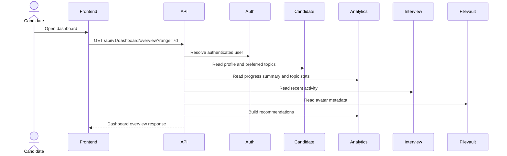

# Dashboard

## Overview

The dashboard gives an authenticated candidate a single read model for the first dashboard load. It combines account/profile data, analytics aggregates, topic performance, recent interview activity, and recommended next-practice defaults.

The first backend milestone is one aggregate endpoint:

```http
GET /api/v1/dashboard/overview?range=7d
Authorization: Bearer <access_token>
```

Smaller endpoints for stats, performance trend, topics, recent activity, and recommendations can be added later when the frontend needs independent refreshes or pagination.

## Ownership

- `auth` owns the authenticated user identity and email.
- `candidate` owns full name, target role, experience level, onboarding state, and preferred topics.
- `interview` owns interview sessions, selected questions, submitted answers, completion state, and raw outcomes.
- `analytics` owns progress summaries, topic stats, achievements, dashboard aggregation, and recommendations derived from completed interview activity.
- `filevault` owns avatar file metadata and downloads when avatars are attached.

## Data Rules

- Return only data for the authenticated user.
- Use stable IDs plus display names for roles, levels, topics, and generated defaults.
- Use ISO 8601 UTC timestamps for exact events.
- Use `YYYY-MM-DD` dates for chart buckets.
- Use seconds for durations.
- Use integer scores from `0` to `100`.
- Return `null` for unavailable scores, not `0`.
- Return empty arrays for empty sections.
- Sort chart points oldest to newest.
- Do not expose raw prompts, raw AI provider payloads, or private review metadata in dashboard responses.

## Range Values

Supported range values:

```json
["7d", "30d", "90d", "all"]
```

Default range is `7d`.

## First Load



## Empty State

For a candidate without completed sessions:

- `stats.total_interviews.value` is `0`
- `stats.average_score.value` is `null`
- `stats.current_streak_days.value` is `0`
- `stats.total_practice_seconds.value` is `0`
- `performance.points` is empty
- `topics.items`, `topics.weak`, and `topics.strong` are empty
- `recent_activity.items` is empty
- `recommendations.next_interview` should still include defaults from the candidate profile when available

## Future Interview Engine Notes

Dashboard data depends on interview and review data. The Interview module owns the raw records; Analytics derives dashboard aggregates from those records.

- Save every question shown to the candidate, even when it is AI-generated.
- Save submitted answers exactly as entered.
- Save AI review output, score, rubric breakdown, feedback, prompt version, model/provider metadata, and timestamps.
- Derive analytics from persisted interview/review records instead of asking AI to recompute old results.
- Keep historical dashboard results reproducible when prompts or models change.
