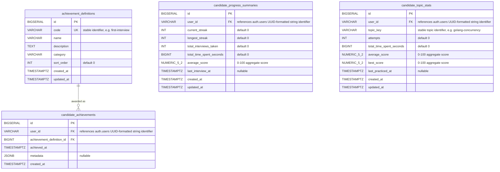

# Analytics Module ERD

## Schema

The analytics tables reside in the `analytics` schema.

## Notes

- `candidate_progress_summaries.user_id` is unique, enforcing one summary row per candidate
- `candidate_topic_stats` should be unique per `user_id + topic_key`
- `achievement_definitions.code` is unique and stable for business logic and API references
- `candidate_achievements` should be unique per `user_id + achievement_definition_id`
- `current_streak`, `longest_streak`, `total_interviews_taken`, and `total_time_spent_seconds` are constrained to be non-negative
- `average_score` and `best_score` are constrained to the range `0..100`
- Strengths and weaknesses should be derived from `candidate_topic_stats` at read time or through dedicated analytics queries, not stored as standalone mutable fields
- When implementing the migration, follow [Migration Guideline](../../../guidelines/13_db_migrations.md): create tables first, create indexes second, then add foreign keys and check constraints with `ALTER TABLE`
