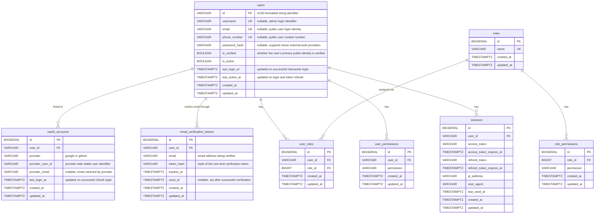

# Auth Module ERD

## Notes

- `username`, `email`, and `phone_number` are nullable to support different actor types in the same `users` table
- Admin accounts authenticate with `username + password`; public users authenticate with `email + password`
- Public users may alternatively authenticate through linked `oauth_accounts` for Google and GitHub
- `oauth_accounts` should enforce uniqueness for `(provider, provider_user_id)`
- `email_verification_tokens` stores only a hash of the raw token sent to the user's email
- `email_verification_tokens` should enforce uniqueness for `token_hash`
- Only the latest unused, unexpired token for a user/email should be accepted for verification
- Business-profile and interview-preparation data for public users should live in a separate module such as `candidate`
- When implementing the migration, follow [Migration Guideline](../../../guidelines/13_db_migrations.md): create tables first, create indexes second, then add foreign keys and check constraints with `ALTER TABLE`
