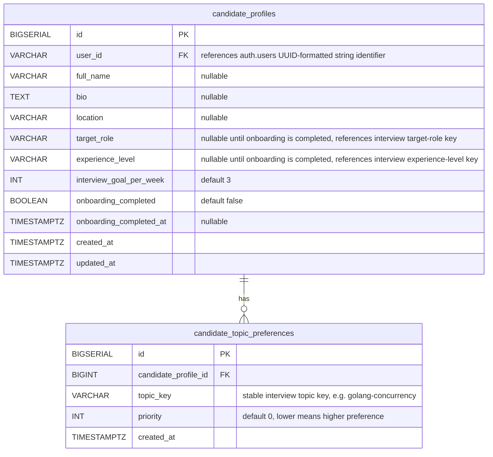

# Candidate Module ERD

## Schema

The candidate tables reside in the `candidate` schema.

## Notes

- `candidate_profiles.user_id` references `auth.users(id)` and is unique, enforcing a one-to-one relationship
- `candidate_topic_preferences` stores one row per preferred topic; do not store preferred topics as JSONB on the profile row
- `candidate_profiles.target_role` stores an Interview catalog target-role key selected by the user
- `candidate_profiles.experience_level` stores an Interview catalog experience-level key selected by the user
- `candidate_topic_preferences.topic_key` stores an Interview catalog topic key selected by the user
- Candidate stores selected keys only; Interview owns the selectable catalog records and display labels
- `interview_goal_per_week` is constrained to be non-negative
- `priority` is constrained to be non-negative
- Candidate profile data is intentionally limited to stable, user-editable fields
- A profile may be created with only baseline registration data and completed later through profile/onboarding use cases
- `onboarding_completed` is set to true when target role, experience level, and preferred topics are saved
- `onboarding_completed_at` is nullable until onboarding is completed
- Derived metrics such as streaks, interview counts, average scores, strengths, and weaknesses should not be stored here
- Profile photo/avatar should be stored through `filevault` and attached to the candidate profile entity using an association type such as `avatar`
- When implementing the migration, follow [Migration Guideline](../../../guidelines/13_db_migrations.md): create tables first, create indexes second, then add foreign keys and check constraints with `ALTER TABLE`
