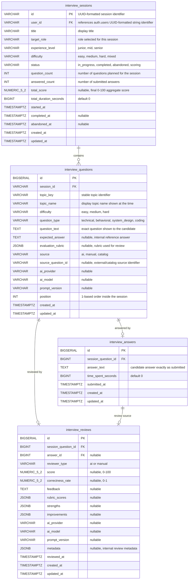

# Interview Module ERD

## Schema

The interview tables reside in the `interview` schema.

## Notes

- `interview_sessions.user_id` references `auth.users(id)` conceptually; module code should still communicate across modules through portals.
- `interview_sessions.status` is constrained to `in_progress`, `completed`, `abandoned`, or `scoring`.
- `interview_sessions.difficulty` is constrained to `easy`, `medium`, `hard`, or `mixed`.
- `interview_sessions.experience_level` is constrained to `junior`, `mid`, or `senior`.
- `interview_questions.difficulty` is constrained to `easy`, `medium`, or `hard`.
- `interview_questions.source` is constrained to `ai`, `manual`, or `catalog`.
- `interview_reviews.reviewer_type` is constrained to `ai` or `manual`.
- `interview_questions` should be unique by `session_id + position`.
- `interview_answers` should allow one current answer per session question.
- `interview_reviews` should allow one current review per session question.
- Scores are constrained to `0..100`; correctness rate is constrained to `0..1`.
- Durations and counts are constrained to be non-negative.
- When implementing the migration, follow [Migration Guideline](../../../guidelines/13_db_migrations.md): create tables first, create indexes second, then add foreign keys and check constraints with `ALTER TABLE`.
